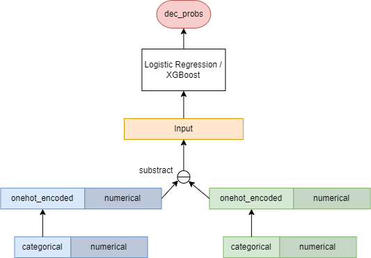
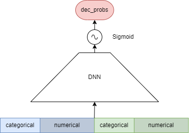
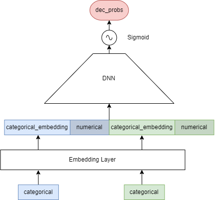
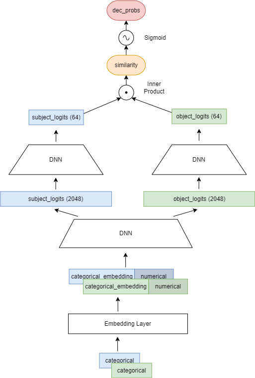
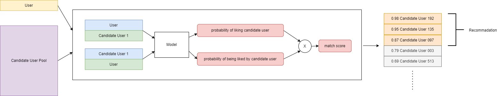

# IBA6108 Project - a Mate Recommender System 

> 数据源：https://tianchi.aliyun.com/competition/entrance/531825/information


## Get Started

### 准备  

- 适用版本：`python 3.8+`
- 依赖安装
    ```shell
    pip install -r requirements.txt
    ```
- 其中`pytorch`需要根据设备cuda版本自行安装

### 训练  

```python
python ./src/training_pipeline.py --model [MODEL]
```
或在脚本中设置参数并启动  
```shell
bash ./train.sh
```

其中，模型对应的参数为（后续相同）：  
- **XGBoost**: `xgboost`
- **LR**: `lr`
- **DNN**: `dnn`
- **Embedding + DNN**: `ebd_dnn`
- **Embedding + FORK-DNN**: `fork`

### 推荐  

```python
python ./src/recommender.py \
    --model [MODEL] \
    --recommend_users [待推荐用户csv路径] \
    --user_pool [候选用户池csv路径]\
    --output_file [结果json输出路径] \
    --top [用户推荐数量]
```
或在脚本中设置参数并启动  
```shell
bash ./recommend.sh
```

## 模型

### 问题定义


### Baseline：LR & XGBoost  



### DNN  



### Embedding + DNN



### Embedding + FORK-DNN



### 评估结果  
|**model**|**accuracy**|**f1**|**auc**|
|:-----:|-------|----|----|
|**LR**|0.6383|0.5201|0.6746|
|**XGBoost**|0.6654|0.5986|0.7257|
|**DNN**|0.6660|0.6165|0.7227|
|**Embedding + DNN**|0.6931|0.6150|0.7556|
|**Embedding + FORK-DNN**|0.7454|0.7106|0.8032|


## 推荐




