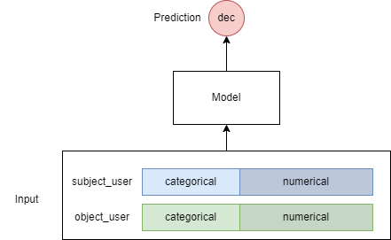

# IBA6108 Project - a Mate Recommender System 

> 数据源：https://tianchi.aliyun.com/competition/entrance/531825/information

## 准备  

- 适用版本：`python 3.8+`
- 依赖安装
    ```shell
    pip install -r requirements.txt
    ```
- 其中`pytorch`需要根据设备cuda版本自行安装

## 训练  

```python
python ./src/training_pipeline.py --model [MODEL]
```
或在脚本中设置参数并启动  
```shell
bash ./train.sh
```

## 推荐  

```python
python ./src/recommender.py \
    --model [MODEL] \
    --recommend_users [待推荐用户csv路径] \
    --user_pool [候选用户池csv路径]\
    --output_file [结果json输出路径] \
    --top [用户推荐数量]
```
或在脚本中设置参数并启动  
```shell
bash ./recommend.sh
```

## 模型

### 问题定义


